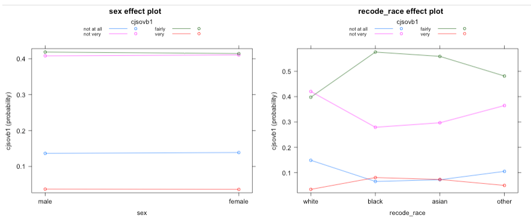
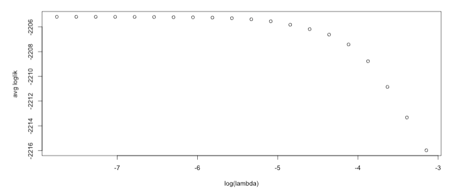

### Sidebar on the left

In this part of the app, you have four boxes.
* YEAR BOX allows you to select as many years as you wish. However, NB: you might select a combination of years that results in an empty dataframe.
* MODEL BOX allows you to choose the model you want to use. The default one is a proprotional odds, but after performing diagnostics, you can choose another model.
* RESPONSE VARIABLES BOX allows you to choose one variable that you want to predict.
* EXPLANATORY VARIABLES BOX allows you to choose as many variables as you wish.

<p>&nbsp;</p> 

Some suggestions: 
* 1980s tend to be poorly populated. 
* Response variables starting with "How good a job...?" tend to be associated with the 1990s and early 2000s
* Response variables starting with "How confident...?" or "How much do you agree or disagree...?" tend to be associated with the 2000s

<p>&nbsp;</p>
________________________

### MODEL SUMMARY TAB

This tab produces two boxes: the output of the model and the output of cross validation.


### 1. Model output: model summary

a. PROPORTIONAL ODDS MODEL

Let's take this output as an example:

```{r}
Coefficients:
                    Value Std. Error t value
sexfemale        -0.04111   0.057290 -0.7176
recode_raceblack -0.11843   0.173910 -0.6810
recode_raceasian  0.44584   0.132669  3.3605
recode_raceother -0.10512   0.192318 -0.5466
ncrime1          -0.03265   0.008027 -4.0674

Intercepts:
                    Value    Std. Error t value 
not at all|not very  -2.3616   0.0639   -36.9425
not very|fairly      -0.3572   0.0475    -7.5170
fairly|very           2.8519   0.0764    37.3489

Residual Deviance: 9737.253 
AIC: 9753.253 
(4785 observations deleted due to missingness)
```

Here we model confidence in the CJS as a whole as a function of sex and race. You have all the coeffiecients (in log odds) associated with each level of the explanatory variable, their Standard Error (the smaller, the better) and t-value. 

For each explanatory variable we have a single coefficient for each level of that variable (minus the baseline level): we can exponentiate the coefficients, so to obtain the change in the odds of being in or below a particular confidence level. This is relative to the reference respondent (baseline). For example, exponeniating the coeffiecient of Asian victim, we can say that the odds of being equal or below a particular confidence level are 1.6 times higher than the baseline (White respondents):

```{r}

exp(0.44584)

1.561802
                    
```

In general:
* Coeffiecients of categorical variables can be interpreted as follows: moving from the baseline category to another category associated with higher likelihood of having (or not) a "higher/more positive" attitude.
* Coeffiecients of numerical variables can be interpreted as follows: with one increase in the predictor, the log odds of having "attitude" increase/decrease by...

We also get 3 intercepts. They can be interpreted as the log odds of being in or below a particular level of confidence for the reference respondent (baseline): *not at all vs not very*; *not very vs fairly*; *fairly vs very* 


For the intercetps (one for each level of the response), the baseline is:

\[
logit \left[P\left(Y \leq {highest~category} \right)\right]
\]

So, if you have 3 categories: e.g 1 = too little; 2 = about right; 3 = too much, this would results in the following intercepts:

too little vs about right:

\[
log \left [ {P(Y \leq too~little)} \over {P(Y>too~little)}  \right ] = log \left [ {P(Y \leq too~little)} \over {P(Y \geq about~right)}  \right ] = logit [P(Y \leq too~little)] 
\]


about right vs too much:

\[
log \left [ {P(Y \leq about~right)} \over {P(Y>about~right)}  \right ] = log \left [ {P(Y \leq about~right)} \over {P(Y \geq too~much)}  \right ] = logit [P(Y \leq about~right)]
\]

The output also provides Residual Deviance and AIC score: you can use these values to compare different models.

Further information about interpretation can be found:  

<a href=https://data.library.virginia.edu/fitting-and-interpreting-a-proportional-odds-model/> Fitting and Interpreting a Proportional Odds Model </a> 

<a href=https://online.stat.psu.edu/stat504/node/157/> Analysis of Deviance and Model Selection </a> 

<a href=https://en.wikipedia.org/wiki/Akaike_information_criterion> Akaike information criterion (AIC score) </a> 

Details regarding the algorithm used for the estimation of this model (polr() in the R package MASS) can be found <a href=https://cran.r-project.org/web/packages/MASS/MASS.pdf> here </a> 

<p>&nbsp;</p>

b. MULTINOMIAL LOGISTIC REGRESSION

The output here is interpretable in a similar way to the proportional odds model.

Let's take this output as an example:

```{r}
Coefficients:
         (Intercept)   sexfemale recode_raceblack recode_raceasian recode_raceother
not very   1.3032561  0.12634618       -0.2994767        0.1352818        0.1627267
fairly     1.8453957  0.06591461       -0.3514160        0.3338617        0.1087117
very      -0.3710264 -0.36502815        0.6215666        1.0768902        0.7655074

Std. Errors:
         (Intercept) sexfemale recode_raceblack recode_raceasian recode_raceother
not very  0.09218251 0.1227123        0.3278162        0.3025228        0.3730866
fairly    0.08797485 0.1175301        0.3121716        0.2882827        0.3607953
very      0.12643741 0.1744471        0.3971747        0.3498309        0.4598970

Residual Deviance: 8644.897 
AIC: 8674.897
```

Here, we compare categories in relation to a baseline category. Again, we get 3 sets of coefficients: one for each level of the response (*not very*, *fairly*, *very*). Similarly to the previous model, we exponentiate the slope coefficients to obtain the change in the odds of being in particular category (in relation to the baseline).

You can interpret the intercept coefficents as the log odds of being in a specific confidence level of the baseline:

too little vs about right:

\[
logit \left(\frac{[P\left(Y = too~little \right)]} {[P\left(Y = about~right \right)]}\right)
\]

about right vs too much:
\[
logit \left(\frac{[P\left(Y = about~right \right)]} {[P\left(Y = too~much \right)]}\right)
\]

Interestingly in the examples of this tutorial, Residual Deviance and AIC score are slightly lower than the previous model, suggesting that a multinomial approach is perhaps a better fit. 

Further information about interpretation can be found:  

<a href=https://online.stat.psu.edu/stat504/node/171/> Multinomial Logistic Regression Models </a> 

<a href=http://www.columbia.edu/~so33/SusDev/Lecture_10.pdf> Logistical Regression II— Multinomial Data </a> 

<a href=https://stats.idre.ucla.edu/r/dae/multinomial-logistic-regression/> Multinomial Logistic Regression | R Data Analysis Examples </a> 

Details regarding the algorithm used for the estimation of this model (multinom() in the R package nnet) can be found <a href=https://cran.r-project.org/web/packages/nnet/nnet.pdf> here </a> 

<p>&nbsp;</p>

c. (ORDINAL) RIDGE REGRESSION

If the assumption of multicollinearity in the prop odds model is violated, you should use this model. In this model output, you first have a information about which fold the model is training on and then all the coeffiecients (in log odds) associated with each level of the explanatory variable. As this is an ordinal model, intercept vary, but slopes are constant. Interpretation follows the one described in the proportional odds model.

```{r}

                 logit(P[Y<=1]) logit(P[Y<=2]) logit(P[Y<=3])
(Intercept)         -1.73610017     0.28299134     3.36276222
sexfemale           -0.03984307    -0.03984307    -0.03984307
recode_raceblack    -0.73489659    -0.73489659    -0.73489659
recode_raceasian    -0.62783688    -0.62783688    -0.62783688
recode_raceother    -0.35198371    -0.35198371    -0.35198371
```

An error will appear if you select the variable sex only as predictor: this is due to the functionality of the function used to estimate the ordinal ridge model that requires the argument for predictors to be a matrix. 

NB: because of k-fold cross validation, this model will take longer to be computed. 
NB: a similar approach could be taken if assumption of no multicollinearity is violeted in the mudtinimial model. However, we didn't include it here for now. 


Details regarding the algorithm used for the estimation of this model (ordinaNetTune() in the R package ordinalNet) can be found <a href=https://cran.r-project.org/web/packages/ordinalNet/ordinalNet.pdf> here </a> 

<p>&nbsp;</p>

### 2. Model output: model validation

In the second box you can see the accuracy of your selected model (e.g. 0.5238905635 = 52% accuracy). Accuracy is the degree to which the model classifies data close to their true values. 

Cross validation and k-fold cross validation are used to evaluate the models' predictive performance.

For cross-validation (in prop odds and multinomial models), data are split in:

* Train data (70% of the sample): these data are used to fit the model and train it.
* Test data (remaining 30% of the sample): these data are used to evaluate how good the model is.

For k-fold cross validation (in the ridge model), data are randomly divided in 3 groups (folds) of about equal size. 2 folds are used for training the model and 1 fold for testing it.  

Further information can be found <a href=https://en.wikipedia.org/wiki/Cross-validation_(statistics)> here </a> 

<p>&nbsp;</p>
__________________________

### ASSUMPTION TESTING TAB

Here you will find two outputs:

1) Variance inflation factor for multicollinearity

Here you check for multicollinearity: the output provides you with variance inflation factor (VIF). The column of interest here is GVIF^(1/(2*Df)). Ideally, VIF should not exceed a value of 10 (Belsley, D. A., Kuh, E. & Welsch, R. E. (1980). Regression Diagnostics: Identifying Influential Data and  Sources of Collinearity. New York: John Wiley).

In the example below, we can see that no multicollinearity is present, therefore we don't need to fit a ridge regression model:

```{r}
   GVIF Df GVIF^(1/(2*Df))
sex         1.048320  1        1.023875
recode_race 1.477199  3        1.067185         
```


Further information can be found <a href=https://online.stat.psu.edu/stat462/node/180/> here </a> 

2) Test for proportional odds (for proportional odds model)

Here we are testing for proportional odds using a Brant test. This test assesses whether the observed deviations from the model are larger than what could be attributed by chance. The output will state if the proprotional odds assumption holds or not. 

```{r}
  ---------------------------------------------------- 
Test for		X2	df	probability 
---------------------------------------------------- 
Omnibus			22.42	12	0.03
sexfemale		13.21	3	0
recode_raceblack	3.25	3	0.36
recode_raceasian	5.31	3	0.15
recode_raceother	0.22	3	0.97
---------------------------------------------------- 

H0: Parallel Regression Assumption holds        
``` 


Further information can be found <a href=https://medium.com/evangelinelee/brant-test-for-proportional-odds-in-r-b0b373a93aa2> here </a> and <a href=https://cran.r-project.org/web/packages/brant/brant.pdf> here </a>

<p>&nbsp;</p>
__________________________

### PREDICTED PROBABILITIES AND PLOTS TAB

In this tab, you have a visualization of the predicted probabilities for each level of the response variable. You can see how predicted probabilities of being in a particular confidence/satisfaction/ect leveke changes for each level of the explanatory variables. For example, for each level of the response, when moving from male to female victim, not much difference is noticeable. For the variable race, however, differences are more marked: for example, looking at the level "fairly" (green, top line), when moving from white respodent to black respondent, the predicted level of confidence increases from about 40% to about 55%. 

NB: always make sure to check the values and scale on the y-axis. Big jumps from one level of the predictor to another might not be so big once you check the y-axis. 



For ridge regression, the average out-of-sample log-likelihood is plotted. Here we are interested in the $log(\lambda)$ that maximises the likelihood (when the dots start descending).




Further information can be found here:
<a href=https://data.library.virginia.edu/visualizing-the-effects-of-proportional-odds-logistic-regression/> Visualizing the Effects of Proportional-Odds Logistic Regression </a> 


<p>&nbsp;</p>
__________________________

### Error messages

The most probable cause of an error message is that the chosen combination of variables/years results in an empty dataframe (e.g. Error: missing value where TRUE/FALSE needed). You can increase the number of years or try a different combination of variables. This should solve the issue. 

<p>&nbsp;</p>
________________________________________________________________________________________________________________________________________________________________

### Variable Dictionary

### Choice of responses

The response variable is a choice among the following variables:

* with 5 levels - "very poor", "poor", "fair", "good", "excellent" 

"How good a job do you think the CPS are doing?" ("jobcps")

"How good a job do you think judges are doing?" ("jobjud")

"How good a job do you think magistrates are doing?" ("jobmag")

"How good a job do you think the probation services are doing?" ("jobprob")

"How good a job do you think the juvenile courts are doing?" ("jobjuv")

<p>&nbsp;</p>
________________________________________________________________________________________________________________________________________________________________


* with 4 levels - "not at all", "not very", "fairly", "very"

"How confident are you Crown Prosecution Service is effective at prosecuting?" ("cjscpsb")

"How confident are you Courts are dealing with cases promptly?" ("cjscrt2a")

"How confident are you Courts are effective at giving punishments?" ("cjscrt2b")

"How confident are you - Criminal Justice System as a whole is effective?" ("cjsovb1")

"How much do you agree or disagree that the Criminal Justice System gives victims and witnesses the support they need?" ("fairatt1")

"How confident are you that the Criminal Justice System as a whole is fair?" ("fairova1")

"How confident you are that CJS is effective in bringing people to justice?" ("confoff")

"How confident are you that the CJS meets the needs of victim?" ("confvict")

<p>&nbsp;</p>
________________________________________________________________________________________________________________________________________________________________

### Choice of explanatory variables

The explanatory variables are:

sex ("sex") = "male", "female" 

race ("recode_race") = "white", "black", "asian", "other

age ("recode_age") = "under 25", "26-39", "40-59", "60-79", "over 80"

education level ("recode_educat3") = high", "A-levels", "GCSE", "other/no"

income ("recode_income") = "low", "mid", "top"

gepgraphical location ("gor") = "north east", "north west", "Yorks&Humberside", "east midlands", "west midlands", "east of England", "London", "south east", "south west", "Wales", "Scotland"

crime being reported to police ("recode_reported) = "no", "yes"

victim of bulglary ("victim_bgl") = "no", "yes"

victim of property crime ("victim_prp") = "no", "yes"

victim of vehicle crime ("victim_veh") = "no", "yes"

victim of violent crime ("victim_vio") = "no", "yes"

victim of sex crime ("victim_vio2") = "no", "yes"


<p>&nbsp;</p>
<p>&nbsp;</p>
<p>&nbsp;</p>
<p>&nbsp;</p>
<p>&nbsp;</p>
____________________________________________________________________________________________________________________________________________________________________________
